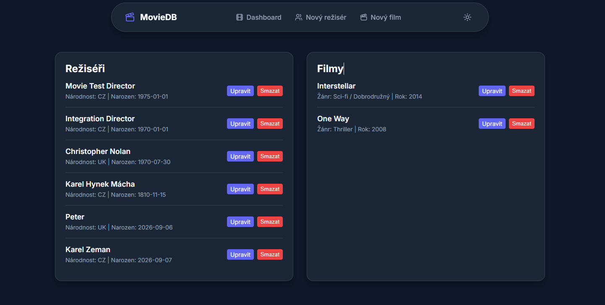
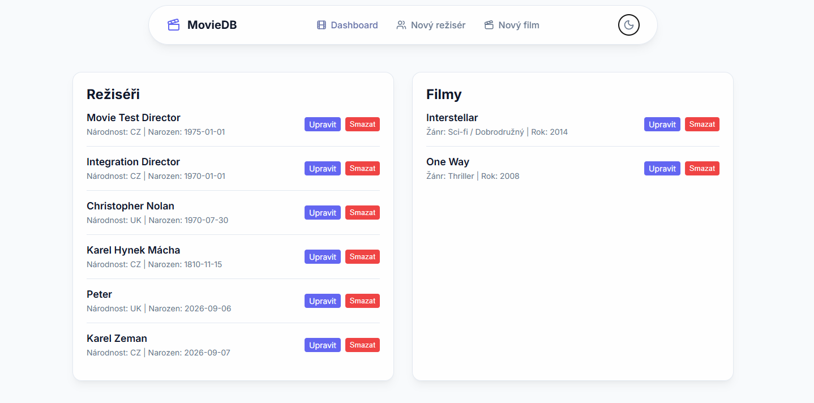
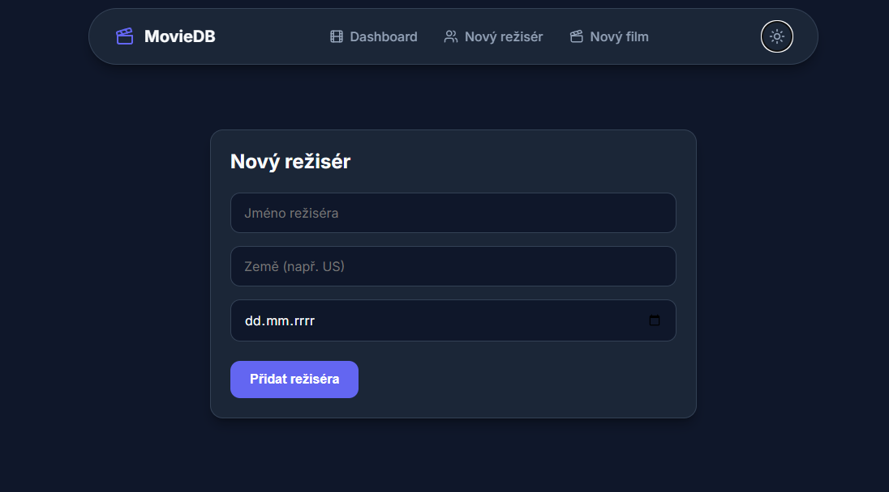
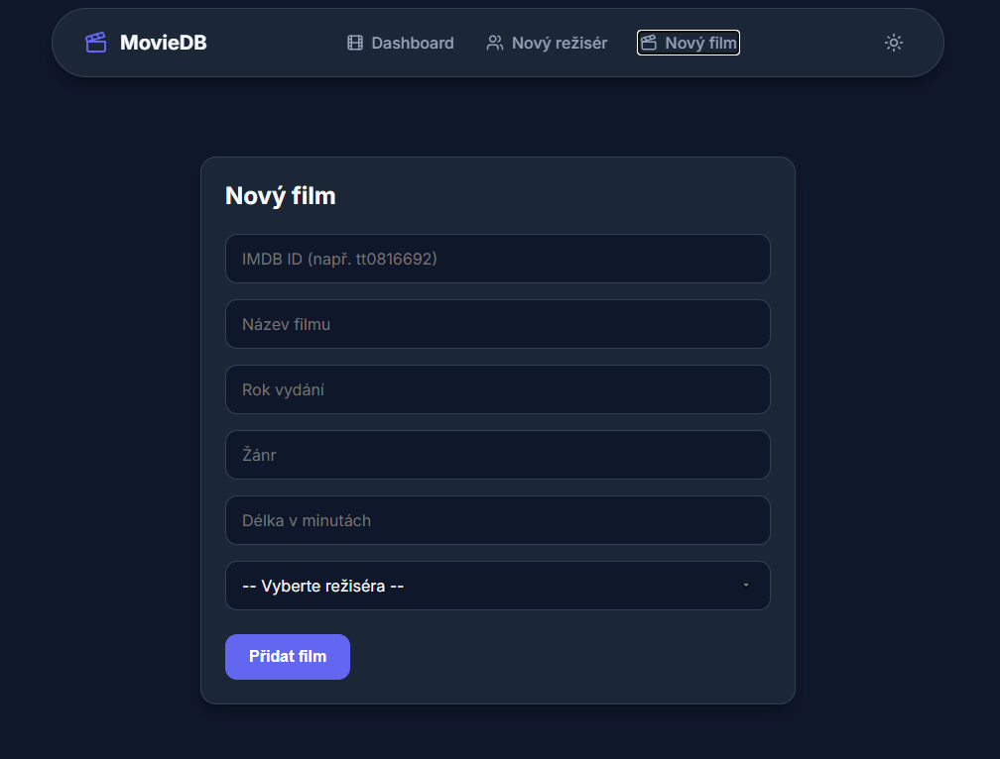

# 🎬 MovieDatabase (Full-Stack React & .NET)

Komplexní full-stack aplikace pro správu filmů a režisérů, spojující moderní frontend v **Reactu** a RESTful webové API vytvořené v **ASP.NET Core**.[cite: 1] Projekt využívá relační databázi PostgreSQL a obsahuje komplexní integrační testy pokrývající celý životní cyklus entit.[cite: 1] Vznikl jako .NET protějšek dřívějšího Java/Spring Boot projektu [Java-Book-Database](https://github.com/Lukas-Cernoch/Java-Book-Database), pro srovnání stejného konceptu ve dvou různých ekosystémech.[cite: 1]

## 📸 Ukázky aplikace (Frontend)

## 🛠️ Použité technologie a knihovny

### Backend (.NET)
- **Platforma:** .NET (C#)[cite: 1]
- **Webový framework:** ASP.NET Core Web API[cite: 1]
- **ORM a databáze:** Entity Framework Core, PostgreSQL (běžící v Dockeru)[cite: 1]
- **Mapování a Validace:** AutoMapper, FluentValidation[cite: 1]
- **Testování:** xUnit, WebApplicationFactory (integrační testy)[cite: 1]
- **Aktualizace dat:** JSON Patch (standard RFC 6902) s využitím Newtonsoft.Json[cite: 1]

### Frontend (React)
- **Platforma:** React s TypeScriptem (sestaveno přes Vite)
- **Routing:** React Router (SPA navigace)
- **Styling:** Čisté CSS s proměnnými, Glassmorphism efekty
- **Ikony:** Lucide React

## 🖥️ Frontend (Uživatelské rozhraní)

- **Single Page Application (SPA):** Plnohodnotné routování na straně klienta zaručuje okamžitou navigaci bez znovunačítání stránky.
- **Centralizovaný API Klient:** Komunikace s backendem (`fetch`, hlavičky, zpracování chyb) je oddělena do vyhrazené API vrstvy.
- **Moderní UI/UX & Glassmorphism:** Aplikace využívá prémiový design s poloprůhlednými prvky a plynulými interakcemi.
- **Dark/Light Mode:** Plně integrované přepínání světlého a tmavého režimu pomocí CSS proměnných, s perzistentním uložením volby do `localStorage`.
- **Optimalizovaný CRUD:** Částečné aktualizace (`PATCH`) pomocí `JsonPatchDocument` a kaskádové mazání automaticky synchronizované do globálního stavu.

## 🗃️ Datový model

### Director (Režisér)
- `Id` (Guid) — primární klíč[cite: 1]
- `Name` (string) — jméno režiséra (povinné, max. 100 znaků)[cite: 1]
- `DateOfBirth` (DateOnly) — datum narození (povinné, nesmí být v budoucnosti)[cite: 1]
- `Nationality` (string) — národnost (povinná)[cite: 1]

### Movie (Film)
- `ImdbId` (string) — primární klíč (např. `"tt0816692"`)[cite: 1]
- `Title` (string) — název filmu (povinné)[cite: 1]
- `ReleaseYear` (int) — rok vydání (platný rozsah 1888 až současnost + 5 let)[cite: 1]
- `Genre` (string) — žánr filmu[cite: 1]
- `RuntimeMinutes` (int) — délka filmu v minutách (musí být striktně větší než 0)[cite: 1]
- `DirectorId` (Guid) — cizí klíč na `Director` (nastaveno kaskádové mazání)[cite: 1]

## 📮 Přehled API endpointů

### Directors
| Metoda | Cesta | Popis |
|---|---|---|
| `GET` | `/directors` | seznam všech registrovaných režisérů[cite: 1] |
| `GET` | `/directors/{id}` | detail konkrétního režiséra podle Guid[cite: 1] |
| `POST` | `/directors` | vytvoření nového režiséra[cite: 1] |
| `PUT` | `/directors/{id}` | kompletní aktualizace (výměna celého objektu)[cite: 1] |
| `PATCH` | `/directors/{id}` | částečná aktualizace pomocí pole JSON Patch operací[cite: 1] |
| `DELETE` | `/directors/{id}` | smazání režiséra a kaskádové smazání jeho filmů[cite: 1] |

### Movies
| Metoda | Cesta | Popis |
|---|---|---|
| `GET` | `/movies` | seznam filmů[cite: 1] |
| `GET` | `/movies/{imdbId}` | detail filmu[cite: 1] |
| `POST` | `/movies` | vytvoření filmu (vyžaduje existující `DirectorId`)[cite: 1] |
| `PUT` | `/movies/{imdbId}` | create-or-update — vytvoří film, pokud neexistuje, jinak ho kompletně přepíše[cite: 1] |
| `PATCH` | `/movies/{imdbId}` | částečná úprava pomocí JSON Patch instrukcí[cite: 1] |
| `DELETE` | `/movies/{imdbId}` | smazání záznamu o filmu[cite: 1] |

## ✅ Zpracování a validace (FluentValidation)

Validace vstupních dat je řešena odděleně od logiky kontrolerů pomocí **FluentValidation**.[cite: 1] Každý příchozí DTO objekt při požadavcích `POST`, `PUT` a `PATCH` je automaticky ověřen na shodu se stanovenými pravidly definovanými ve validačních třídách.[cite: 1] Pokud data nevyhovují (např. chybí povinné pole, délka filmu je menší než 0), API požadavek automaticky zamítne se stavovým kódem `400 Bad Request` a vrátí detailní zprávu o tom, která pole selhala.[cite: 1]

## 🚀 Spuštění projektu

### 1. Spuštění Backend API
- .NET SDK[cite: 1]
- Docker a Docker Compose[cite: 1]
- EF Core nástroje: `dotnet tool install --global dotnet-ef`[cite: 1]

1. Spusťte databázový server PostgreSQL (např. pomocí připraveného kontejneru v Dockeru): `docker-compose up -d`[cite: 1]
2. Aplikujte databázové schéma: `dotnet ef database update`[cite: 1]
3. Spusťte webový server: `dotnet run`[cite: 1]
4. Otevřete prohlížeč na adrese `http://localhost:<VÁŠ_PORT>/swagger` pro zobrazení interaktivní dokumentace API.[cite: 1]

### 2. Spuštění Frontend aplikace
- Požadavky: Node.js (v18+)

1. Přejděte do složky frontendu (např. `cd movie-frontend`).
2. Nainstalujte závislosti: `npm install`
3. Spusťte vývojový server: `npm run dev`

## 🧪 Testování

Systém obsahuje plnohodnotné integrační testy využívající **xUnit** a **WebApplicationFactory**.[cite: 1] Tyto testy spouští kompletní HTTP infrastrukturu aplikace v paměti a ověřují skutečné fungování databázových operací, mapování, validací a návratových HTTP kódů.[cite: 1] Testy lze hromadně spustit z Test Exploreru ve Visual Studiu, nebo přes terminál:[cite: 1]
`dotnet test`[cite: 1]

## 📬 Postman kolekce

Pro usnadnění prozkoumávání API a manuálního testování projekt zahrnuje soubor `postman_collection.json`.[cite: 1] Jedná se o Postman kolekci ve formátu verze 2.1.0, obsahující přednastavené šablony nejběžnějších požadavků jako `POST`, `GET`, `PATCH` nebo `DELETE`, které využívají formát těla typu `raw` JSON.[cite: 1] Soubor lze přímo naimportovat do aplikace Postman.[cite: 1]

## 👤 Autor

**Lukáš Černoch**[cite: 1]  
[GitHub](https://github.com/Lukas-Cernoch)[cite: 1]